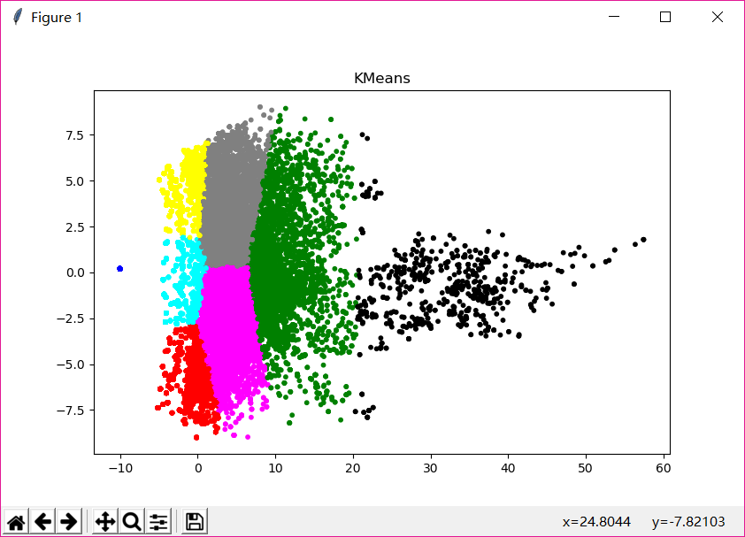

# 中间层输出分析

运行方法：先运行mine_new.py，再运行time_analyze.py
参数在文件中设置

##降维

首先我尝试使用了PCA对数据进行降维，得到的特征系数为

[0.5375959  0.14495616 0.08954158 0.05214058 0.03728145 0.0259136
 0.01746986 0.01664067 0.01017799 0.00903055] 只有前两个特征值大于0.1，因此我将原始数据降到了二维

##聚类

在聚类时我一开始尝试了k=10的kmeans，但我不能确定“10”这个参数的选择是否合适，因此我尝试用meanshift方法重新聚类，但是速度实在太慢了，而且运行很长时间之后还会报错，尝试了几次都没有能够得到收敛的结果，于是我还是回到了kmeans，得到了下图

## 分析聚类结果

得到了聚类结果之后，我想着在时间上对数据进行aggregate，然后画出折线图，看看是否有比较明显的趋势结果

使用250帧为步长（10秒）对数据进行聚合之后画出结果，可以看到参数在时间上确实有比较明显的变化趋势，但是和阵型标注的结果之间没有找到特别清晰、明显的关系